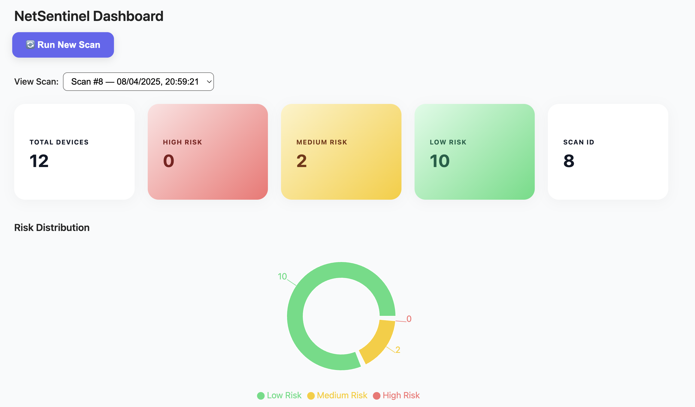

# NetSentinel

**NetSentinel** is a sleek, full-stack network security dashboard that scans and visualises devices on your local network. Built with a modern developer experience in mind — powered by **TypeScript**, **React**, **PostgreSQL**, and a Stripe-inspired UI.

> Your personal digital watchdog for connected devices — with risk scoring, port analysis, and animated visual reporting.

---

## 📸 Preview

<!-- Replace with your screenshot path -->

---

## 🚀 Features

### 🔍 Network Scanning
- Detects all active devices via ARP + Ping Sweep
- Retrieves IP & MAC addresses
- Scans common ports (22, 80, 443, etc.)

### 🔐 Device Risk Profiling
- Calculates a risk score based on:
  - Open ports
  - IP range
  - Broadcast/multicast detection
- Classifies device types (Router, Server, Passive, etc.)

### 📊 Interactive Dashboard
- Responsive React UI with live device table
- Summary cards with gradient colour-coding
- Animated risk distribution pie chart
- Selectable scan history
- “Run New Scan” button with live updates

### 🧱 Built with
- **Frontend:** React + Vite + TypeScript + Framer Motion
- **Backend:** Node.js + Express + Prisma + PostgreSQL
- **Design:** Stripe-inspired layout with smooth animations and gradient risk cues

---

## 📦 API Endpoints

| Endpoint            | Description                       |
|---------------------|-----------------------------------|
| `/devices`          | Run a new network scan            |
| `/scan/history`     | List of all past scans            |
| `/scan/:id`         | Get device results for one scan   |
| `/scan/summary`     | Aggregated summary (latest scan)  |

---

## 🧠 Why This Project?

NetSentinel demonstrates:

- Real-world networking & scanning logic  
- Full-stack TypeScript fluency  
- Strong UX with clean, modern UI  
- A deployable product that solves a practical problem

---

## 🙌 Credits & Inspiration

- Stripe Dashboard
- Framer Motion
- Recharts
- YouTube: Network security and scanning concepts

---

## 👨‍💻 Author

Built with ❤️ by **Ozan Gokberk**  
Computer Science Student & Software Engineer
